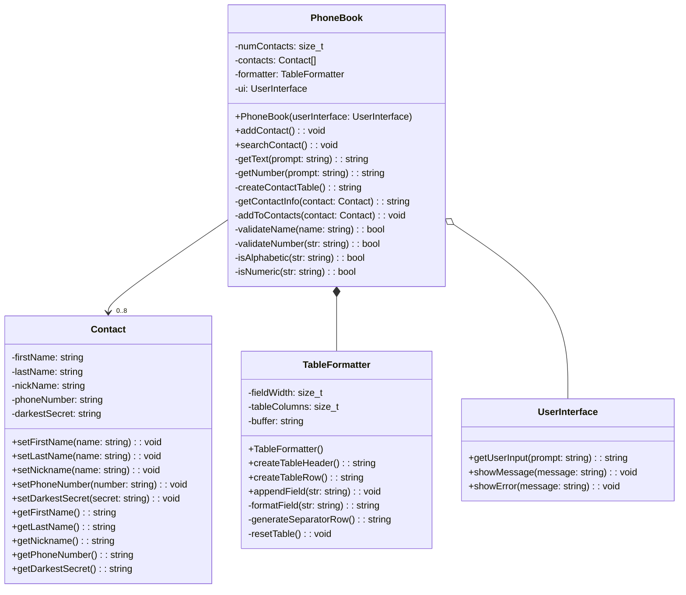

# Module 00

## ex01

```mermaid
classDiagram
    class TableFormatter {
        +TableFormatter()
        +createTableHeader(): string
        +createTableRow(): string
        +appendField(str: string): void
        -fieldWidth: size_t
        -tableColumns: size_t
        -buffer: string
        -formatField(str: string): string
        -generateSeparatorRow(): string
        -resetTable(): void
    }

    class UserInterface {
        +getUserInput(prompt: string): string
        +showMessage(message: string): void
        +showError(message: string): void
    }

    class Contact {
        +setFirstName(name: string): void
        +setLastName(name: string): void
        +setNickname(name: string): void
        +setPhoneNumber(number: string): void
        +setDarkestSecret(secret: string): void
        +getFirstName(): string
        +getLastName(): string
        +getNickname(): string
        +getPhoneNumber(): string
        +getDarkestSecret(): string
        -firstName: string
        -lastName: string
        -nickName: string
        -phoneNumber: string
        -darkestSecret: string
    }

    class PhoneBook {
        +PhoneBook(userInterface: UserInterface)
        +addContact(): void
        +searchContact(): void
        -numContacts: size_t
        -contacts: Contact[]
        -formatter: TableFormatter
        -ui: UserInterface
        -getText(prompt: string): string
        -getNumber(prompt: string): string
        -createContactTable(): string
        -getContactInfo(contact: Contact): string
        -addToContacts(contact: Contact): void
        -validateName(name: string): bool
        -validateNumber(str: string): bool
        -isAlphabetic(str: string): bool
        -isNumeric(str: string): bool
    }

    PhoneBook --> "0..8" Contact
    PhoneBook *-- TableFormatter
    PhoneBook o-- UserInterface
```
